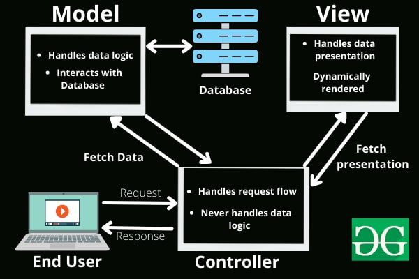

# Project Title

A brief description of what this project does and who it's for.

## Description

Provide a more detailed explanation of the project. What problem does it solve? What are the key features?

## Getting Started

### Prerequisites

List any software, libraries, or tools that need to be installed before using the project.

```bash
# Example prerequisite installation command
npm install -g some-cli-tool
```

### Installation

Provide step-by-step instructions on how to install the project.

1. Clone the repo
   ```bash
   git clone https://github.com/your_username/your_project_name.git
   ```
2. Navigate to the project directory
   ```bash
   cd your_project_name
   ```
3. Install dependencies (example for Node.js)
   ```bash
   npm install
   ```
   *(Adjust based on your project's package manager, e.g., pip install -r requirements.txt for Python)*

## Usage

Explain how to use the project after installation. Provide code examples or command-line usage instructions.

```python
# Example Python usage
import your_module

result = your_module.some_function()
print(result)
```

```bash
# Example command-line usage
your_script --input data.txt --output results.txt
```

Include screenshots or GIFs if applicable to demonstrate usage.

## Features

- View available commands (`help`)
- Get the actual IP address of the machine (`myip`)
- Display the listening port number (`myport`)
- Establish TCP connections with other peers (`connect`)
- View all active connections (`list`)
- Terminate specific connections (`terminate`)
- Send messages to connected peers (`send`)
- Exit the program and clean up all active connections (`exit`)

## Directory structure:
```
.
├── inc/
│   ├── header1.h           
│   ├── header2.h           
│   ├── header3.h
│   ├── header4.h
│   └── header5.h
├── src/
│   ├── source1.c
│   ├── source2.c
│   ├── source3.c
│   ├── source4.c
│   └── source5.c
├── main.c
├── Makefile
└── README.md
```

## High level design
<!-- add picture by  -->

Function block of model MVC:

 

Some UML C++:


## Contributing

Explain how others can contribute to the project. Include guidelines for pull requests, reporting bugs, and suggesting enhancements.

1. Fork the Project
2. Create your Feature Branch (`git checkout -b feature/AmazingFeature`)
3. Commit your Changes (`git commit -m 'Add some AmazingFeature'`)
4. Push to the Branch (`git push origin feature/AmazingFeature`)
5. Open a Pull Request

Refer to a `CONTRIBUTING.md` file for more detailed guidelines if you have one.

## License

Specify the license under which the project is distributed.

Distributed under the [License Name] License. See `LICENSE.txt` for more information.

*(Choose an appropriate license, e.g., MIT, Apache 2.0, GPLv3. If you don't have a LICENSE.txt file, remove the reference or create one.)*

---

## Contact

Your Name - [@your_twitter](https://twitter.com/your_twitter) - your.email@example.com

Project Link: [https://github.com/your_username/your_project_name](https://github.com/your_username/your_project_name)

---

## Acknowledgements

List any resources, libraries, or individuals you want to thank or acknowledge.

*   [Resource Name](https://example.com)
*   Readme Template Inspiration
*   etc.


