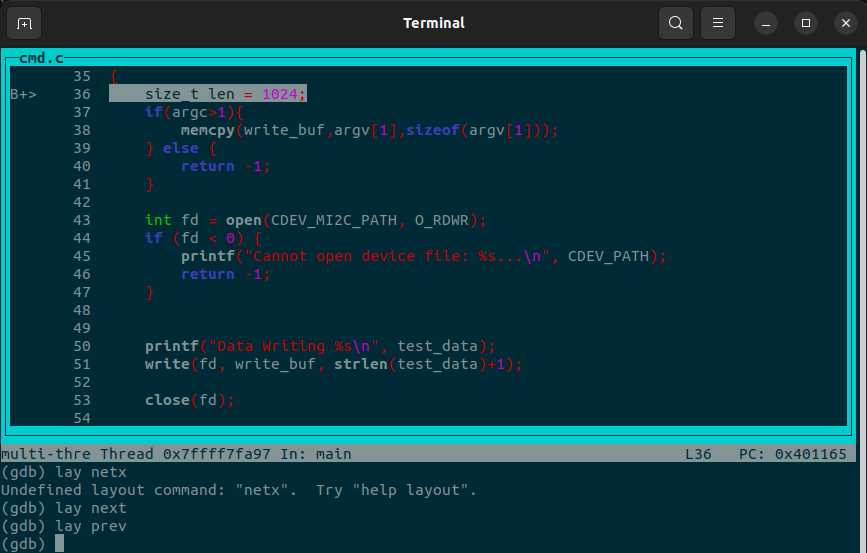

# Using the GDB Tool

GDB (GNU Debugger) is a powerful tool for debugging C/C++ programs. Below are basic steps to use GDB:

## 1. Compile with Debug Symbols

Compile your program with the `-g` flag to include debug information:

```sh
gcc -g -O0 your_program.c -o your_program
```

P/S: flag `-O` is optimize compiler option, usong `-O0` for debug. If project in "release" or "production" can be change to `-O2` or `-O3` for reducing compiling time process.

## 2. Start GDB

Launch GDB with your executable:

```sh
gdb ./your_program
```

## 3. Common GDB Commands

### Execute a program
- `run` or `r` – Start your program.
- `quit` or `q` – Exit GDB.


Note: gdb support I/O so it can be used for output for a file Ex:`(gdb) run > output.txt`

you can pass arrgument comand line with `(gdb) run arg1 arg2 arg3`

### Add or delete a breakpoint
- `break` or `b` – Set a breakpoint.

Ex1: file 
```terminal
(gdb) break my_program.c:25
```

Ex2: function 
```terminal
(gdb) break my_class::my_method
```

Ex3: breakpoint with if condition
```terminal
(gdb) break my_function if x == 100
or
(gdb) condition <break num> <condition>
```

- `delete <Num>` or `d <Num>` – Delete a breakpoint
- `info break` or `i b` – list all breakpoints set

### Dubug step tool
- `next` or `n` – Execute next line (step over).
- `step` or `s` – Step into function calls.
- `continue` or `c` – Continue running until next breakpoint.
- `finish` – execute  the "step into function" until it return to previous function call

### Print and watch
- `print` or `p` – Print the value of a variable.

Ex:
```termninal
(gdb) print <variable>  // show a varibale

(gdb) print (a + b) * 2 // show expression

(gdb) print *<pointer>  // show value of the pointer point to

(gdb) print array@10 // print the first 10 elements of array
```

- `watch` – Stop program when variable is changed.

### Function trace
- `frame` – Chose a frame on call stack to check
- `backtrace` or `bt` – Show the call stack.

### Thread debug
- `info threads` – list all running thread in program: ID of gdb, id of LightWeight Process, current threads. The current thread is marked with `*`.
- `thread <ID>` – Focus on thread ID
- `thread apply all <command>` – Apply a command for all thread

### Change debug layout screen
- `lay next` or `lay prev` – change view screen





## 4. Core Dumps
Explain: `Core Dumps` is a dump of memory, carry out typically as an aid for debugging
 

1. Activate Core Dump (if inactive by default):

```terminal
ulimit -c unlimited
```

2. Load Core Dump into gdb:

syntax: gdb <file_execute> <file_core>

```terminal
gdb ./main core
```
*this command will jump into the time when program is crashed*

3. Brief analysis

- `bt` or `bt full` to check call stack function
- `frame` or `up` or `down` to control stack call
- `print` check value of variables
- `info locals` and `info args` check argument and local variable
- `x` check raw memory